#  ROS1 → ROS2 代码迁移攻略

> **适用场景**： ROS1（Noetic）迁移至 ROS2（Humble / jazzy）  
> **涵盖内容**：架构差异 · 代码迁移 · 构建系统 · 组件化 · 性能优化  

---

## 目录

1. [核心架构变化对比](#1-核心架构变化对比)
2. [节点初始化与生命周期](#2-节点初始化与生命周期对比)
3. [通信机制全面升级](#3-通信机制全面升级对比)
4. [时间处理系统](#4-时间处理系统对比)
5. [参数系统升级](#5-参数系统升级对比)
6. [TF2 坐标变换系统](#6-tf2-坐标变换系统对比)
7. [消息类型命名空间变化](#7-消息类型命名空间变化对比)
8. [智能指针管理](#8-智能指针管理对比)
9. [日志系统升级](#9-日志系统升级对比)
10. [构建系统迁移](#10-构建系统迁移对比)
11. [启动文件变化](#11-启动文件变化对比)
12. [消息传递的零拷贝与高效数据交换](#12-消息传递的零拷贝与高效数据交换)
13. [组件化与生命周期管理](#13-组件化与生命周期管理)
14. [执行器与多线程处理](#14-执行器与多线程处理)
15. [参数动态重配置](#15-参数动态重配置)
16. [动作服务器与客户端](#16-动作服务器与客户端)
17. [服务服务器与客户端](#17-服务服务器与客户端)

---

## 迁移总览

在开始迁移之前，请先了解整体工作流程：

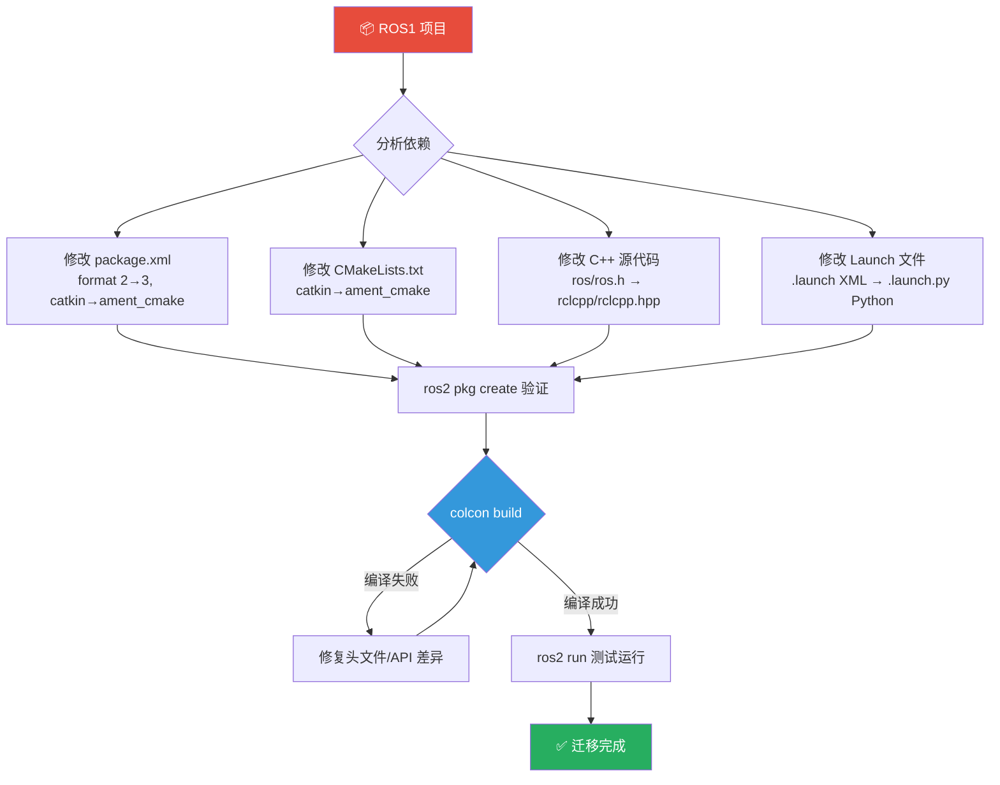

> **图注**：迁移流程是迭代的——编译错误是正常现象，按照本文各章节逐步修正即可。重点关注 `package.xml`、`CMakeLists.txt` 和 C++ API 三个层次的变更。

---

## 1. 核心架构变化对比

### 1.1 中心化 vs 分布式架构

ROS1 与 ROS2 最根本的区别在于通信架构的设计哲学：

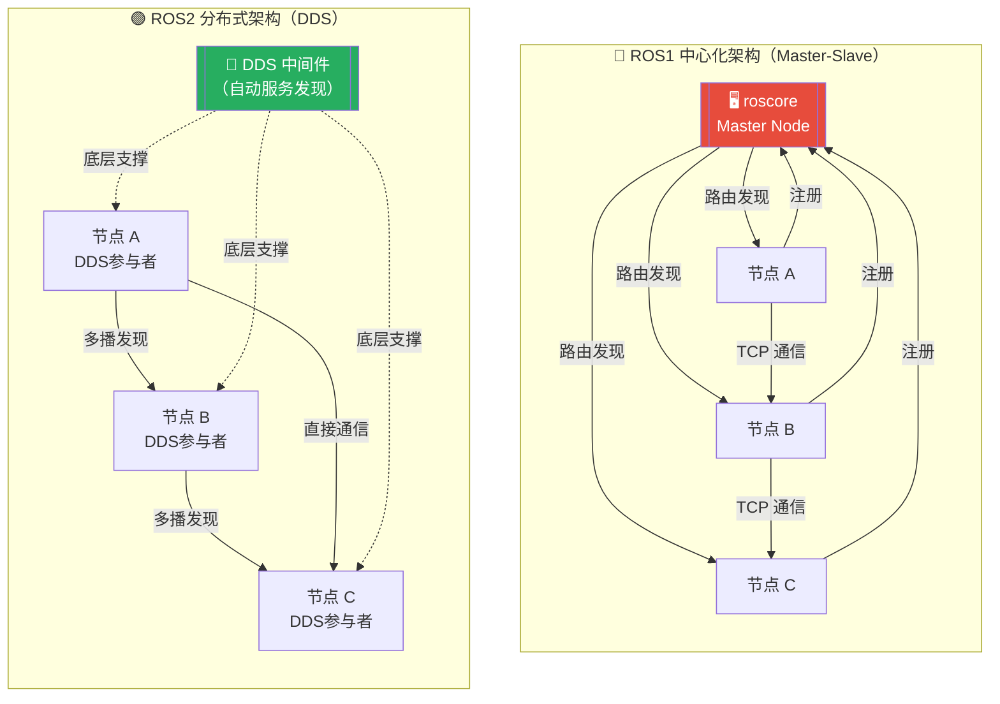

> **图注**：  
> - **ROS1**：所有节点必须先向 `roscore`（Master）注册，Master 一旦崩溃，整个系统瘫痪——这是机甲大师比赛中的致命弱点。  
> - **ROS2**：基于 DDS（Data Distribution Service）标准，节点之间通过多播协议自动发现彼此，无单点故障，更适合实战环境。

**ROS1 启动方式（需要 roscore）**

```bash
# ROS1 必须先启动 roscore 中心节点
roscore

# 在另一个终端启动节点
rosrun my_package my_node
```

**ROS2 启动方式（无需 roscore）**

```bash
# ROS2 无需中心节点，直接启动
ros2 run my_package my_node
```

### 1.2 迁移优势对比

| 特性 | ROS1 | ROS2 | 机甲大师场景影响 |
|------|------|------|-----------------|
| 架构 | 中心化 Master | 分布式 DDS | 比赛中更稳定，Master 崩溃不再是噩梦 |
| 单点故障 | Master 崩溃则系统瘫痪 | 无单点故障 | 提升系统可靠性 |
| 节点发现 | 依赖 Master | 多播自动发现 | 节点动态加入/退出更灵活 |
| 网络支持 | 仅 TCP | TCP/UDP，支持 VPN/防火墙 | 跨网络调试更方便 |
| 实时性 | 较差 | 支持实时系统 | 自瞄延迟显著降低 |
| QoS 控制 | 无 | 细粒度配置 | 可针对图像/控制分别调优 |

---

## 2. 节点初始化与生命周期对比

### 2.1 节点创建完整对比

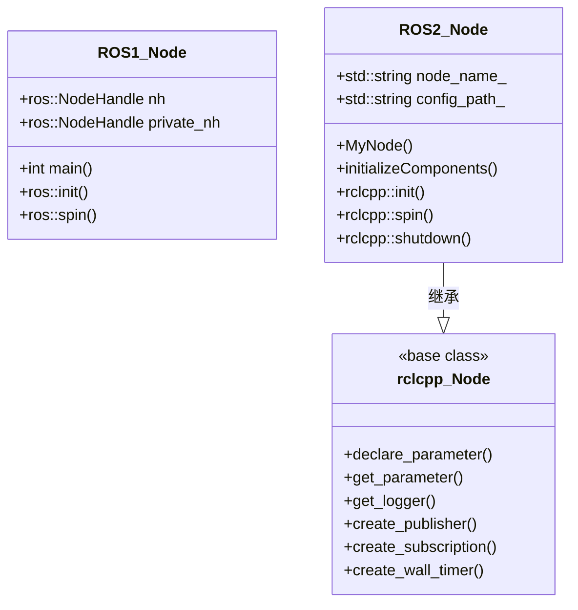

> **图注**：ROS2 推荐将节点封装成类并继承 `rclcpp::Node`，而非 ROS1 的面向过程风格。这使得组件化复用和生命周期管理成为可能。

**ROS1 传统方式**

```cpp
#include <ros/ros.h>

int main(int argc, char** argv) {
    // ROS1 初始化
    ros::init(argc, argv, "my_node");
    
    // 创建节点句柄
    ros::NodeHandle nh;
    ros::NodeHandle private_nh("~");
    
    // 参数获取
    std::string config_path;
    private_nh.param<std::string>("config_path", config_path, "default_path");
    
    ROS_INFO("Node %s started with config: %s", 
             ros::this_node::getName().c_str(), 
             config_path.c_str());
    
    // 主循环
    ros::spin();
    
    return 0;
}
```

**ROS2 现代化方式**

```cpp
#include "rclcpp/rclcpp.hpp"

class MyNode : public rclcpp::Node {
public:
    MyNode() : Node("my_node") {
        // ROS2 参数声明（推荐在构造函数中声明）
        this->declare_parameter<std::string>("config_path", "default_path");
        this->get_parameter("config_path", config_path_);
        
        RCLCPP_INFO(this->get_logger(), 
                   "Node %s started with config: %s", 
                   this->get_name(), 
                   config_path_.c_str());
        
        // 初始化组件
        initializeComponents();
    }

private:
    void initializeComponents() {
        // 组件初始化代码
    }
    
    std::string config_path_;
};

int main(int argc, char** argv) {
    // ROS2 初始化
    rclcpp::init(argc, argv);
    
    // 创建节点（使用智能指针）
    auto node = std::make_shared<MyNode>();
    
    // 运行节点
    rclcpp::spin(node);
    
    // 清理
    rclcpp::shutdown();
    
    return 0;
}
```

> **⚠️ 迁移注意**：`ros::NodeHandle` 在 ROS2 中完全消失，改为在 `rclcpp::Node` 的成员函数中直接操作（`this->create_publisher()`、`this->declare_parameter()` 等）。

---

## 3. 通信机制全面升级对比

### 3.1 发布者/订阅者 API 完整对比

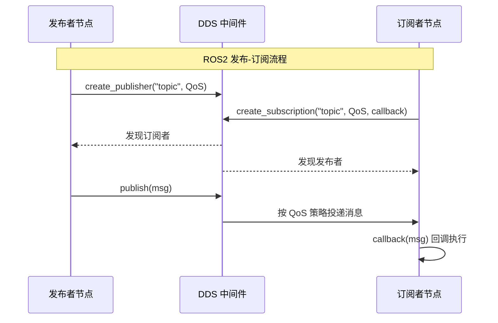

> **图注**：ROS2 的发布-订阅不再经过 Master 路由，而是由 DDS 中间件直接完成节点发现与消息投递，降低了端到端延迟。

**ROS1 发布订阅方式**

```cpp
// ROS1 发布者
ros::Publisher pub = nh.advertise<std_msgs::String>("topic", 10);

// ROS1 订阅者
void callback(const std_msgs::String::ConstPtr& msg) {
    ROS_INFO("Received: %s", msg->data.c_str());
}
ros::Subscriber sub = nh.subscribe("topic", 10, &MyClass::callback, this);
```

**ROS2 发布订阅方式**

```cpp
// ROS2 发布者（现代风格）
this->pub_ = this->create_publisher<std_msgs::msg::String>("topic", 10);

// ROS2 订阅者（Lambda 风格，推荐）
this->sub_ = this->create_subscription<std_msgs::msg::String>(
    "topic", 
    10, 
    [this](const std_msgs::msg::String::SharedPtr msg) {
        RCLCPP_INFO(this->get_logger(), "Received: %s", msg->data.c_str());
    }
);

// 或者使用 std::bind（保持与 ROS1 相似）
this->sub_ = this->create_subscription<std_msgs::msg::String>(
    "topic", 
    10, 
    std::bind(&MyClass::callback, this, std::placeholders::_1)
);
```

### 3.2 服务质量（QoS）— ROS2 核心特性

QoS（Quality of Service）是 ROS2 相对 ROS1 最重要的新特性之一，允许针对不同类型数据配置不同的传输策略：

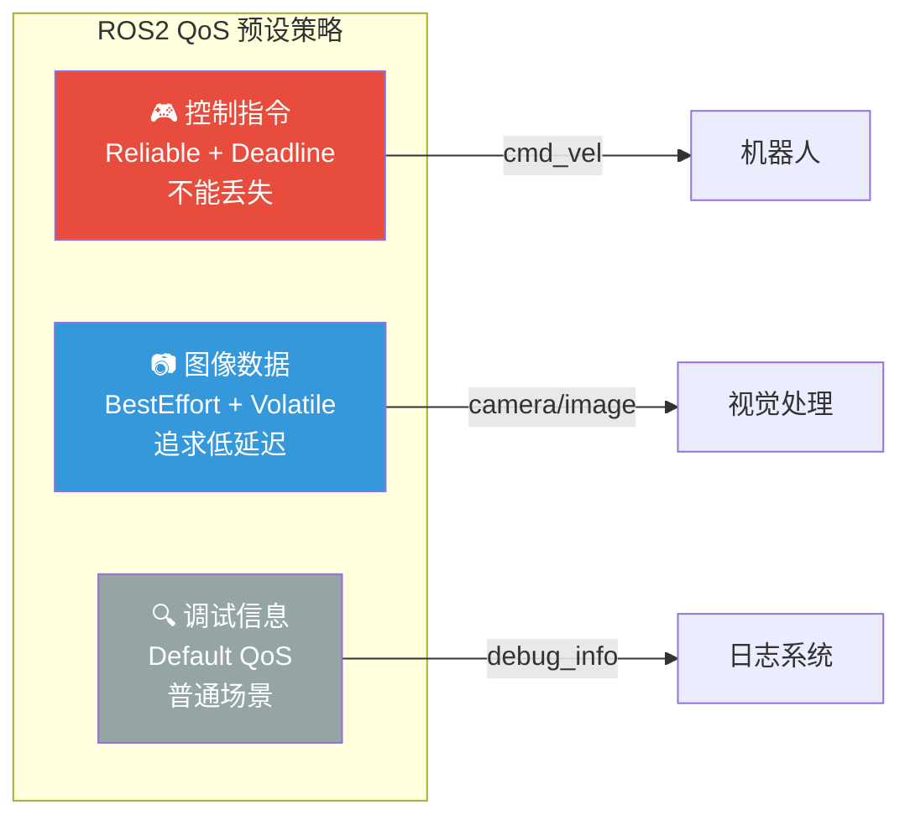

> **图注**：机甲大师中不同类型的数据对 QoS 的需求截然不同——控制指令必须可靠传输（`reliable`），图像帧则优先低延迟（`best_effort`），这是 ROS1 无法原生支持的能力。

**机甲大师中的 QoS 配置示例**

```cpp
// 控制指令 - 需要可靠传输，不能丢失
auto control_qos = rclcpp::QoS(10)
    .reliable()              // 可靠传输
    .durability_volatile()   // 不持久化
    .deadline(rclcpp::Duration(0, 100000000))  // 100ms 截止时间
    .liveliness(rclcpp::LivelinessPolicy::Automatic)
    .liveliness_lease_duration(rclcpp::Duration(1, 0));  // 1秒租约

control_pub_ = this->create_publisher<geometry_msgs::msg::Twist>(
    "cmd_vel", 
    control_qos
);

// 图像数据 - 追求低延迟，容忍丢失
auto image_qos = rclcpp::SensorDataQoS();  // ROS2 提供的传感器预设
image_sub_ = this->create_subscription<sensor_msgs::msg::Image>(
    "camera/image", 
    image_qos,
    std::bind(&VisionNode::imageCallback, this, std::placeholders::_1)
);

// 调试信息 - 使用默认配置即可
debug_pub_ = this->create_publisher<std_msgs::msg::String>(
    "debug_info", 
    10  // 默认 QoS，10 的队列深度
);
```

---

## 4. 时间处理系统对比

### 4.1 时间 API 完整对比

| API | ROS1 | ROS2 |
|-----|------|------|
| 获取当前时间 | `ros::Time::now()` | `this->now()` 或 `std::chrono::steady_clock::now()` |
| 创建时间段 | `ros::Duration(1.0)` | `rclcpp::Duration::from_seconds(1.0)` 或 `1s` |
| 休眠 | `ros::Duration(0.1).sleep()` | `std::this_thread::sleep_for(100ms)` |
| 时间比较 | 减法后比较 | 同 ROS1 或使用 chrono |

**ROS1 时间处理**

```cpp
#include <ros/ros.h>

ros::Time start_time = ros::Time::now();
ros::Duration timeout(1.0);  // 1秒超时

// 检查是否超时
if ((ros::Time::now() - last_update_time) > timeout) {
    ROS_WARN("Update timeout!");
    // 超时处理
}

// 休眠
ros::Duration(0.1).sleep();  // 休眠 100ms
```

**ROS2 时间处理**

```cpp
#include "rclcpp/rclcpp.hpp"

// 方式1：使用 ROS2 时间类（保持与 ROS1 相似）
rclcpp::Time start_time = this->now();
rclcpp::Duration timeout = rclcpp::Duration::from_seconds(1.0);

if ((this->now() - last_update_time) > timeout) {
    RCLCPP_WARN(this->get_logger(), "Update timeout!");
    // 超时处理
}

// 方式2：使用 std::chrono（C++ 标准，推荐）
using namespace std::chrono_literals;

auto timeout = 1s;  // C++14 字面量
auto start_time = std::chrono::steady_clock::now();

// 检查是否超时
if (std::chrono::steady_clock::now() - last_time > timeout) {
    RCLCPP_WARN(this->get_logger(), "Timeout!");
}

// 休眠
std::this_thread::sleep_for(100ms);  // 休眠 100ms
```

### 4.2 定时器完整对比

```mermaid
timeline
    title 定时器回调触发时序对比
    section ROS1
        ros::Timer : createTimer(Duration(0.1), callback)
        回调签名 : timerCallback(const ros::TimerEvent& event)
        时间获取 : event.current_real.toSec()
    section ROS2
        create_wall_timer : milliseconds(10), callback
        回调签名 : timerCallback() 无参数
        时间获取 : this->now().seconds()
```

**ROS1 定时器**

```cpp
// ROS1 定时器（基于 ROS 时间）
ros::Timer timer = nh.createTimer(
    ros::Duration(0.1),  // 100ms 周期
    &MyClass::timerCallback, 
    this
);

// ROS1 定时器回调
void MyClass::timerCallback(const ros::TimerEvent& event) {
    ROS_INFO("Timer triggered at %f", event.current_real.toSec());
}
```

**ROS2 定时器**

```cpp
// ROS2 定时器（基于 std::chrono）
timer_ = this->create_wall_timer(
    std::chrono::milliseconds(10),  // 10ms 周期
    std::bind(&MyClass::timerCallback, this)
);

// ROS2 定时器回调（无 TimerEvent 参数）
void MyClass::timerCallback() {
    RCLCPP_INFO(this->get_logger(), 
                "Timer triggered at %f seconds", 
                this->now().seconds());
}

// ROS2 也支持基于 ROS 时间的定时器
timer_ = this->create_timer(
    std::chrono::milliseconds(10),
    std::bind(&MyClass::timerCallback, this)
);
```

> **⚠️ 迁移注意**：`create_wall_timer` 使用系统墙上时钟，不受仿真时钟影响；`create_timer` 则响应仿真时钟（`/use_sim_time`）。根据场景选择。

---

## 5. 参数系统升级对比

### 5.1 参数声明与获取完整对比

ROS2 引入了强类型参数系统，必须先**声明**再**获取**：

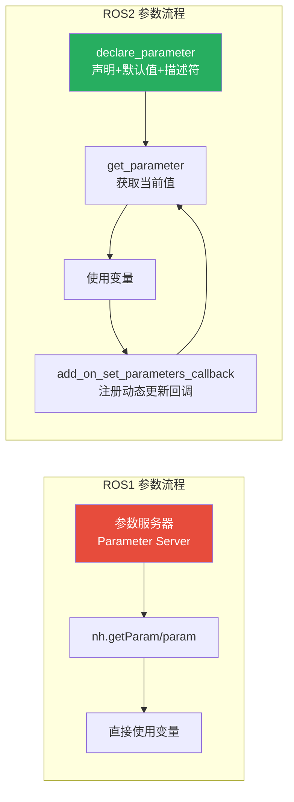

> **图注**：ROS2 参数系统最大的改进是**先声明后使用**——这避免了 ROS1 中因拼写错误导致参数静默失败的问题。同时，参数变更可触发回调，实现运行时动态调整。

**ROS1 参数处理**

```cpp
// ROS1 获取参数
std::string config_path;
int max_targets;
double update_rate;

// 从参数服务器获取参数
nh.param<std::string>("config_path", config_path, "default_path");
nh.param<int>("max_targets", max_targets, 5);
nh.param<double>("update_rate", update_rate, 50.0);

// 检查参数是否存在
if (!nh.getParam("config_path", config_path)) {
    ROS_ERROR("Required parameter 'config_path' not found!");
    return;
}
```

**ROS2 参数处理**

```cpp
// ROS2 声明和获取参数（推荐在构造函数中）
class TrackerNode : public rclcpp::Node {
public:
    TrackerNode() : Node("tracker_node") {
        // 声明参数并设置默认值
        this->declare_parameter<std::string>("config_path", "default_path");
        this->declare_parameter<int>("max_targets", 5);
        this->declare_parameter<double>("update_rate", 50.0);
        
        // 获取参数值
        this->get_parameter("config_path", config_path_);
        this->get_parameter("max_targets", max_targets_);
        this->get_parameter("update_rate", update_rate_);
        
        // 检查是否获取成功
        if (!this->get_parameter("config_path", config_path_)) {
            RCLCPP_ERROR(this->get_logger(), 
                        "Required parameter 'config_path' not found!");
        }
        
        RCLCPP_INFO(this->get_logger(), 
                   "Loaded config: %s, max_targets: %d, update_rate: %.1f",
                   config_path_.c_str(), max_targets_, update_rate_);
    }
    
private:
    std::string config_path_;
    int max_targets_;
    double update_rate_;
};
```

---

## 6. TF2 坐标变换系统对比

### 6.1 TF 相关头文件完整对比

| 功能 | ROS1 头文件 | ROS2 头文件 |
|------|------------|------------|
| 变换监听器 | `tf/transform_listener.h` | `tf2_ros/transform_listener.h` |
| 变换广播器 | `tf/transform_broadcaster.h` | `tf2_ros/transform_broadcaster.h` |
| 数据类型 | `tf/transform_datatypes.h` | `tf2_ros/buffer.h` |
| 消息转换 | `geometry_msgs/TransformStamped.h` | `tf2_geometry_msgs/tf2_geometry_msgs.hpp` |

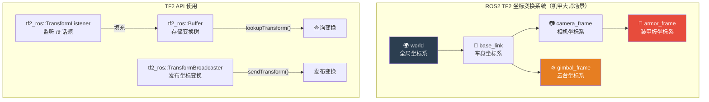

> **图注**：机甲大师自瞄系统中，TF2 用于管理从相机检测到的装甲板位置（`armor_frame`）到云台坐标系（`gimbal_frame`）的变换，以计算正确的瞄准角度。

**ROS1 TF 头文件**

```cpp
#include <tf/transform_listener.h>
#include <tf/transform_broadcaster.h>
#include <tf/transform_datatypes.h>
#include <geometry_msgs/TransformStamped.h>
```

**ROS2 TF2 头文件**

```cpp
#include <tf2_ros/transform_listener.h>
#include <tf2_ros/transform_broadcaster.h>
#include <tf2_ros/buffer.h>
#include <tf2_geometry_msgs/tf2_geometry_msgs.hpp>
#include <geometry_msgs/msg/transform_stamped.hpp>
```

### 6.2 TF 查询与发布完整对比

**ROS1 TF 查询**

```cpp
#include <ros/ros.h>
#include <tf/transform_listener.h>

tf::TransformListener listener;
tf::StampedTransform transform;

try {
    // 等待变换可用（最多等待 1 秒）
    listener.waitForTransform("target_frame", "source_frame", 
                            ros::Time(0), ros::Duration(1.0));
    
    // 获取最新变换
    listener.lookupTransform("target_frame", "source_frame", 
                           ros::Time(0), transform);
    
    // 使用变换
    double x = transform.getOrigin().x();
    double y = transform.getOrigin().y();
    ROS_INFO("Transform: x=%.2f, y=%.2f", x, y);
    
} catch (tf::TransformException &ex) {
    ROS_ERROR("Transform error: %s", ex.what());
}
```

**ROS2 TF2 查询**

```cpp
class TrackerNode : public rclcpp::Node {
public:
    TrackerNode() : Node("tracker_node") {
        // 初始化 TF buffer 和 listener
        tf_buffer_ = std::make_shared<tf2_ros::Buffer>(this->get_clock());
        tf_listener_ = std::make_shared<tf2_ros::TransformListener>(*tf_buffer_);
        
        // 创建定时器定期查询 TF
        timer_ = this->create_wall_timer(
            std::chrono::milliseconds(10),
            std::bind(&TrackerNode::tfTimerCallback, this)
        );
    }

private:
    void tfTimerCallback() {
        try {
            // ROS2 TF 查询
            auto transform = tf_buffer_->lookupTransform(
                "target_frame",           // 目标坐标系
                "source_frame",           // 源坐标系
                tf2::TimePointZero,       // 最新时间
                std::chrono::seconds(1)   // 等待 1 秒
            );
            
            // 使用变换
            double x = transform.transform.translation.x;
            double y = transform.transform.translation.y;
            RCLCPP_INFO(this->get_logger(), 
                       "Transform: x=%.2f, y=%.2f", x, y);
            
        } catch (tf2::TransformException &ex) {
            RCLCPP_ERROR(this->get_logger(), "Transform error: %s", ex.what());
        }
    }
    
    std::shared_ptr<tf2_ros::Buffer> tf_buffer_;
    std::shared_ptr<tf2_ros::TransformListener> tf_listener_;
    rclcpp::TimerBase::SharedPtr timer_;
};
```

**ROS1 TF 发布**

```cpp
#include <tf/transform_broadcaster.h>

tf::TransformBroadcaster broadcaster;
geometry_msgs::TransformStamped transform;

transform.header.stamp = ros::Time::now();
transform.header.frame_id = "parent_frame";
transform.child_frame_id = "child_frame";

// 设置变换
transform.transform.translation.x = 1.0;
transform.transform.translation.y = 0.0;
transform.transform.translation.z = 0.0;

tf::Quaternion q;
q.setRPY(0, 0, 0);
transform.transform.rotation.x = q.x();
transform.transform.rotation.y = q.y();
transform.transform.rotation.z = q.z();
transform.transform.rotation.w = q.w();

// 发布变换
broadcaster.sendTransform(transform);
```

**ROS2 TF 发布**

```cpp
class TrackerNode : public rclcpp::Node {
public:
    TrackerNode() : Node("tracker_node") {
        // 初始化 TF broadcaster
        tf_broadcaster_ = std::make_unique<tf2_ros::TransformBroadcaster>(*this);
        
        // 创建定时器定期发布 TF
        timer_ = this->create_wall_timer(
            std::chrono::milliseconds(10),
            std::bind(&TrackerNode::tfBroadcastCallback, this)
        );
    }

private:
    void tfBroadcastCallback() {
        geometry_msgs::msg::TransformStamped transform;
        
        transform.header.stamp = this->now();
        transform.header.frame_id = "parent_frame";
        transform.child_frame_id = "child_frame";
        
        // 设置平移
        transform.transform.translation.x = 1.0;
        transform.transform.translation.y = 0.0;
        transform.transform.translation.z = 0.0;
        
        // 设置旋转（四元数）
        tf2::Quaternion q;
        q.setRPY(0, 0, 0);  // 滚转、俯仰、偏航角
        
        transform.transform.rotation.x = q.x();
        transform.transform.rotation.y = q.y();
        transform.transform.rotation.z = q.z();
        transform.transform.rotation.w = q.w();
        
        // 发布变换
        tf_broadcaster_->sendTransform(transform);
    }
    
    std::unique_ptr<tf2_ros::TransformBroadcaster> tf_broadcaster_;
    rclcpp::TimerBase::SharedPtr timer_;
};
```

---

## 7. 消息类型命名空间变化对比

### 7.1 命名规则变化总结

ROS2 对消息命名空间做了系统性规范化：

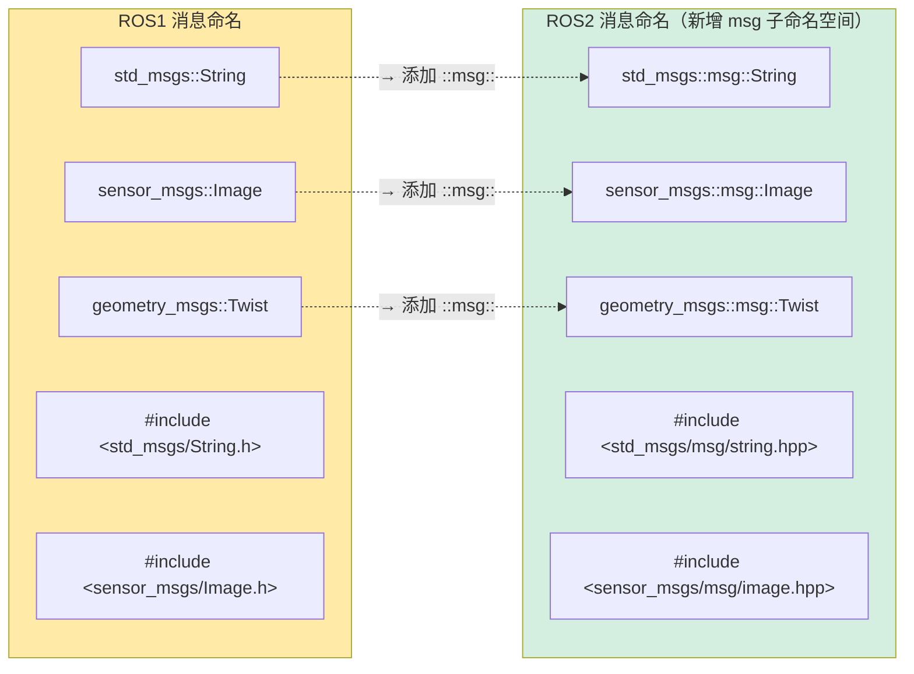

> **图注**：规律很简单——所有消息类型在命名空间中间插入 `::msg::`，头文件从 `.h` 改为 `.hpp`，文件路径中加入 `msg/` 子目录，且文件名改为小写下划线形式。

**ROS1 消息类型**

```cpp
#include <std_msgs/String.h>
#include <std_msgs/Header.h>
#include <std_msgs/Float64.h>
#include <sensor_msgs/Image.h>
#include <geometry_msgs/Twist.h>
#include <geometry_msgs/PoseStamped.h>

// ROS1 消息定义
std_msgs::String string_msg;
sensor_msgs::ImageConstPtr image_msg;  // 常量指针
geometry_msgs::Twist twist_msg;
```

**ROS2 消息类型**

```cpp
#include <std_msgs/msg/string.hpp>
#include <std_msgs/msg/header.hpp>
#include <std_msgs/msg/float64.hpp>
#include <sensor_msgs/msg/image.hpp>
#include <geometry_msgs/msg/twist.hpp>
#include <geometry_msgs/msg/pose_stamped.hpp>

// 使用类型别名提高可读性
using StringMsg = std_msgs::msg::String;
using HeaderMsg = std_msgs::msg::Header;
using Float64Msg = std_msgs::msg::Float64;
using ImageMsg = sensor_msgs::msg::Image;
using TwistMsg = geometry_msgs::msg::Twist;
using PoseStampedMsg = geometry_msgs::msg::PoseStamped;

// ROS2 消息定义（智能指针）
StringMsg::SharedPtr string_msg;      // 共享指针
ImageMsg::SharedPtr image_msg;        // 共享指针
TwistMsg twist_msg;                   // 值类型
```

### 7.2 自定义消息类型对比

**ROS1 自定义消息**

```cpp
// 头文件包含
#include <my_package/MyCustomMessage.h>

// 消息使用
my_package::MyCustomMessage msg;
msg.data = "Hello";
msg.value = 42;
```

**ROS2 自定义消息**

```cpp
// 头文件包含（注意命名空间和文件名变化）
#include <my_package/msg/my_custom_message.hpp>

// 使用命名空间别名
namespace my_msg = my_package::msg;

// 消息使用
auto msg = std::make_shared<my_msg::MyCustomMessage>();
msg->data = "Hello";
msg->value = 42;
```

---

## 8. 智能指针管理对比

### 8.1 资源管理完整对比

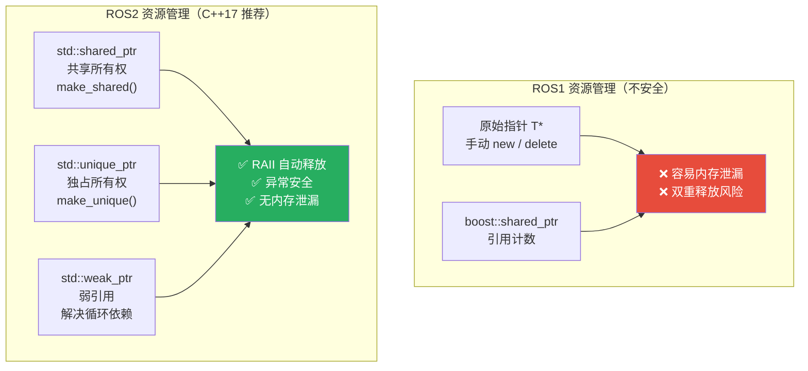

> **图注**：ROS2 全面拥抱现代 C++ 内存管理，`shared_ptr` 用于共享所有权（如发布者、订阅者），`unique_ptr` 用于独占所有权（如 TF Broadcaster），析构函数自动释放资源，无需手动 `delete`。

**ROS1 资源管理**

```cpp
// ROS1 通常使用原始指针或 boost 智能指针
class TrackerNode {
private:
    ros::Publisher* pub_;                // 原始指针（不推荐）
    boost::shared_ptr<ros::Publisher> pub_ptr_;  // boost 智能指针
    
    tf::TransformListener* tf_listener_; // 原始指针
    
public:
    TrackerNode() {
        pub_ = new ros::Publisher(...);  // 手动管理内存
        
        // 需要手动释放
        delete pub_;
    }
    
    ~TrackerNode() {
        if (pub_) delete pub_;
    }
};
```

**ROS2 智能指针使用**

```cpp
#include <memory>
#include "rclcpp/rclcpp.hpp"
#include "tf2_ros/buffer.h"
#include "tf2_ros/transform_listener.h"

class TrackerNode : public rclcpp::Node {
private:
    // 使用智能指针管理所有资源
    std::shared_ptr<tf2_ros::Buffer> tf_buffer_;
    std::unique_ptr<tf2_ros::TransformBroadcaster> tf_broadcaster_;
    
    // ROS2 对象的智能指针管理
    rclcpp::Publisher<geometry_msgs::msg::Vector3>::SharedPtr angle_pub_;
    rclcpp::Subscription<sensor_msgs::msg::Image>::SharedPtr image_sub_;
    rclcpp::TimerBase::SharedPtr timer_;
    
public:
    TrackerNode() : Node("tracker_node") {
        // 使用 make_shared 创建共享指针（推荐）
        tf_buffer_ = std::make_shared<tf2_ros::Buffer>(this->get_clock());
        
        // 使用 make_unique 创建独占指针
        tf_broadcaster_ = std::make_unique<tf2_ros::TransformBroadcaster>(*this);
        
        // ROS2 自动管理发布者和订阅者
        angle_pub_ = this->create_publisher<geometry_msgs::msg::Vector3>("angles", 10);
        
        image_sub_ = this->create_subscription<sensor_msgs::msg::Image>(
            "camera/image", 10,
            std::bind(&TrackerNode::imageCallback, this, std::placeholders::_1)
        );
        
        timer_ = this->create_wall_timer(
            std::chrono::milliseconds(10),
            std::bind(&TrackerNode::timerCallback, this)
        );
    }
    
    // 析构函数自动清理，无需手动释放
    ~TrackerNode() {
        RCLCPP_INFO(this->get_logger(), "TrackerNode destroyed");
    }
};
```

---

## 9. 日志系统升级对比

### 9.1 日志宏完整对比

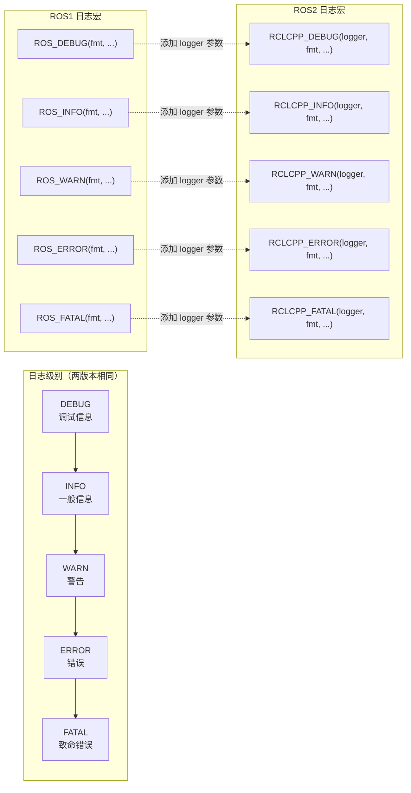

> **图注**：ROS2 日志宏的最大变化是需要传入 `logger` 对象（`this->get_logger()`），这使得每个节点有独立的日志命名空间，调试多节点系统时能快速定位日志来源。

**ROS1 日志系统**

```cpp
// ROS1 日志宏
ROS_DEBUG("Debug message");
ROS_DEBUG_STREAM("Debug stream: " << variable);
ROS_DEBUG_THROTTLE(1.0, "Throttled debug");  // 1秒内只打印一次

ROS_INFO("Info message: %s", data.c_str());
ROS_INFO_STREAM("Info stream: " << variable);
ROS_INFO_THROTTLE(1.0, "Throttled info");

ROS_WARN("Warning message");
ROS_WARN_STREAM("Warning stream: " << variable);

ROS_ERROR("Error message: %s", error_str.c_str());
ROS_ERROR_STREAM("Error stream: " << error);

ROS_FATAL("Fatal error!");
```

**ROS2 日志系统**

```cpp
// ROS2 日志宏（需要节点句柄）
RCLCPP_DEBUG(this->get_logger(), "Debug message");
RCLCPP_DEBUG_STREAM(this->get_logger(), "Debug stream: " << variable);

RCLCPP_INFO(this->get_logger(), "Info message: %s", data.c_str());
RCLCPP_INFO_STREAM(this->get_logger(), "Info stream: " << variable);

RCLCPP_WARN(this->get_logger(), "Warning message");
RCLCPP_WARN_STREAM(this->get_logger(), "Warning stream: " << variable);

RCLCPP_ERROR(this->get_logger(), "Error message: %s", error_str.c_str());
RCLCPP_ERROR_STREAM(this->get_logger(), "Error stream: " << error);

RCLCPP_FATAL(this->get_logger(), "Fatal error!");
```

### 9.2 高级日志功能对比

**ROS1 条件日志**

```cpp
// ROS1 条件日志
ROS_DEBUG_COND(condition, "Conditional debug");
ROS_INFO_COND(condition, "Conditional info");
ROS_WARN_COND(condition, "Conditional warning");

// ROS1 一次性日志
ROS_INFO_ONCE("This will only print once");
ROS_WARN_ONCE("This warning will only appear once");

// ROS1 带时间的日志
ROS_INFO_THROTTLE(1.0, "This prints at most once per second");
ROS_DEBUG_THROTTLE(0.5, "This prints at most twice per second");
```

**ROS2 条件日志**

```cpp
// ROS2 一次性日志
RCLCPP_DEBUG_ONCE(this->get_logger(), "This debug message will only be printed once");
RCLCPP_INFO_ONCE(this->get_logger(), "This info message will only be printed once");
RCLCPP_WARN_ONCE(this->get_logger(), "This warning will only appear once");

// ROS2 带时间的日志（需要时钟）
RCLCPP_INFO_THROTTLE(
    this->get_logger(), 
    *this->get_clock(), 
    1000,  // 毫秒，1秒内只打印一次
    "Throttled info message"
);

RCLCPP_DEBUG_THROTTLE(
    this->get_logger(),
    *this->get_clock(),
    500,   // 毫秒，0.5秒内只打印一次
    "Throttled debug message"
);

// ROS2 表达式日志
RCLCPP_INFO_EXPRESSION(this->get_logger(), 
                      condition, 
                      "This prints only when condition is true");
```

---

## 10. 构建系统迁移对比

### 10.1 构建系统对比总览

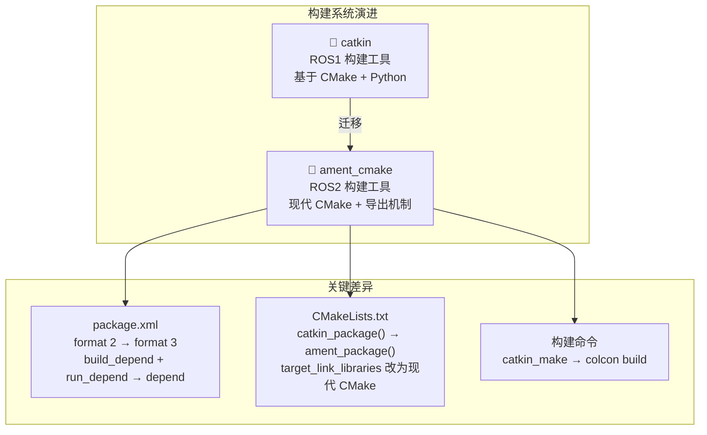

> **图注**：`catkin` 到 `ament_cmake` 的迁移主要体现在三个文件：`package.xml`（格式升级）、`CMakeLists.txt`（现代 CMake 风格）和构建命令（`catkin_make` → `colcon build`）。

### 10.2 `package.xml` 格式完整对比

**ROS1 `package.xml`**

```xml
<?xml version="1.0"?>
<package format="2">
  <name>my_tracker</name>
  <version>1.0.0</version>
  <description>RoboMaster auto-aim tracker node</description>
  
  <maintainer email="team@robomaster.com">RoboMaster Team</maintainer>
  <license>Apache 2.0</license>
  
  <!-- 构建工具依赖 -->
  <buildtool_depend>catkin</buildtool_depend>
  
  <!-- 构建依赖 -->
  <build_depend>roscpp</build_depend>
  <build_depend>sensor_msgs</build_depend>
  <build_depend>geometry_msgs</build_depend>
  <build_depend>tf</build_depend>
  <build_depend>cv_bridge</build_depend>
  <build_depend>image_transport</build_depend>
  
  <!-- 运行时依赖 -->
  <run_depend>roscpp</run_depend>
  <run_depend>sensor_msgs</run_depend>
  <run_depend>geometry_msgs</run_depend>
  <run_depend>tf</run_depend>
  <run_depend>cv_bridge</run_depend>
  <run_depend>image_transport</run_depend>
  
  <!-- 测试依赖 -->
  <test_depend>rostest</test_depend>
</package>
```

**ROS2 `package.xml`**

```xml
<?xml version="1.0"?>
<?xml-model href="http://download.ros.org/schema/package_format3.xsd"
            schematypens="http://www.w3.org/2001/XMLSchema"?>
<package format="3">
  <name>my_tracker</name>
  <version>1.0.0</version>
  <description>RoboMaster auto-aim tracker node</description>
  
  <maintainer email="team@robomaster.com">RoboMaster Team</maintainer>
  <license>Apache 2.0</license>
  
  <!-- 构建工具依赖 -->
  <buildtool_depend>ament_cmake</buildtool_depend>
  
  <!-- 依赖（同时用于构建和运行，取代 build_depend + run_depend） -->
  <depend>rclcpp</depend>
  <depend>sensor_msgs</depend>
  <depend>geometry_msgs</depend>
  <depend>tf2_ros</depend>
  <depend>tf2_geometry_msgs</depend>
  <depend>cv_bridge</depend>
  <depend>image_transport</depend>
  <depend>std_msgs</depend>
  <depend>OpenCV</depend>
  <depend>Eigen3</depend>
  
  <!-- 测试依赖 -->
  <test_depend>ament_lint_auto</test_depend>
  <test_depend>ament_lint_common</test_depend>
  <test_depend>ament_cmake_gtest</test_depend>
  
  <export>
    <build_type>ament_cmake</build_type>
  </export>
</package>
```

### 10.3 `CMakeLists.txt` 完整对比

**ROS1 `CMakeLists.txt`**

```cmake
cmake_minimum_required(VERSION 2.8.3)
project(my_tracker)

# 查找 catkin 和依赖
find_package(catkin REQUIRED COMPONENTS
  roscpp
  sensor_msgs
  geometry_msgs
  tf
  cv_bridge
  image_transport
)

# 查找系统依赖
find_package(OpenCV REQUIRED)
find_package(Eigen3 REQUIRED)

# 包含目录
include_directories(
  include
  ${catkin_INCLUDE_DIRS}
  ${OpenCV_INCLUDE_DIRS}
  ${EIGEN3_INCLUDE_DIRS}
)

# 创建可执行文件
add_executable(tracker_node 
  src/tracker_node.cpp
  src/tracker.cpp
  src/kalman_filter.cpp
)

# 链接库
target_link_libraries(tracker_node
  ${catkin_LIBRARIES}
  ${OpenCV_LIBRARIES}
)

# 安装规则
install(TARGETS tracker_node
  RUNTIME DESTINATION ${CATKIN_PACKAGE_BIN_DESTINATION}
)

# catkin 包
catkin_package(
  INCLUDE_DIRS include
  LIBRARIES tracker_node
  CATKIN_DEPENDS roscpp sensor_msgs geometry_msgs tf
)
```

**ROS2 `CMakeLists.txt`**

```cmake
cmake_minimum_required(VERSION 3.8)
project(my_tracker)

# 设置 C++ 标准
if(NOT CMAKE_CXX_STANDARD)
  set(CMAKE_CXX_STANDARD 17)
  set(CMAKE_CXX_STANDARD_REQUIRED ON)
  set(CMAKE_CXX_EXTENSIONS OFF)
endif()

# 查找 ament_cmake 和依赖
find_package(ament_cmake REQUIRED)
find_package(rclcpp REQUIRED)
find_package(sensor_msgs REQUIRED)
find_package(geometry_msgs REQUIRED)
find_package(tf2_ros REQUIRED)
find_package(tf2_geometry_msgs REQUIRED)
find_package(cv_bridge REQUIRED)
find_package(image_transport REQUIRED)
find_package(OpenCV REQUIRED)
find_package(Eigen3 REQUIRED)

# 创建可执行文件
add_executable(tracker_node 
  src/tracker_node.cpp
  src/tracker.cpp
  src/kalman_filter.cpp
)

# 目标包含目录
target_include_directories(tracker_node PUBLIC
  $<BUILD_INTERFACE:${CMAKE_CURRENT_SOURCE_DIR}/include>
  $<INSTALL_INTERFACE:include>
  ${EIGEN3_INCLUDE_DIRS}
)

# 链接库（现代 CMake 目标风格）
target_link_libraries(tracker_node
  rclcpp::rclcpp
  sensor_msgs::sensor_msgs
  geometry_msgs::geometry_msgs
  tf2_ros::tf2_ros
  tf2_geometry_msgs::tf2_geometry_msgs
  cv_bridge::cv_bridge
  image_transport::image_transport
  ${OpenCV_LIBS}
)

# 安装目标
install(TARGETS tracker_node
  RUNTIME DESTINATION lib/${PROJECT_NAME}
)

# 安装包含文件
install(DIRECTORY include/
  DESTINATION include/
)

# 导出依赖
ament_export_include_directories(include)
ament_export_libraries(tracker_node)
ament_export_dependencies(
  rclcpp
  sensor_msgs
  geometry_msgs
  tf2_ros
  cv_bridge
  OpenCV
)

# 添加测试
if(BUILD_TESTING)
  find_package(ament_lint_auto REQUIRED)
  ament_lint_auto_find_test_dependencies()
endif()

# 生成 ament 包
ament_package()
```

---

## 11. 启动文件变化对比

### 11.1 Launch 文件格式演进

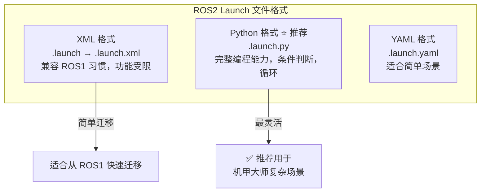

> **图注**：ROS2 推荐使用 Python 格式的 Launch 文件，因为它支持条件判断、循环、变量运算等编程特性，非常适合机甲大师中需要根据机器人型号动态配置节点的场景。

**ROS1 Launch 文件（XML）**

```xml
<launch>
  <!-- 参数服务器设置参数 -->
  <param name="use_sim_time" value="false"/>
  
  <!-- 节点配置 -->
  <node name="tracker" pkg="my_tracker" type="tracker_node" output="screen">
    <!-- 参数 -->
    <param name="config_path" value="$(find my_tracker)/config/tracker.yaml"/>
    <param name="update_rate" value="50.0"/>
    <param name="debug" value="true"/>
    
    <!-- 重映射 -->
    <remap from="/armor_array" to="/detector/armors"/>
    <remap from="/camera/image" to="/camera/color/image_raw"/>
  </node>
  
  <!-- 包含其他 launch 文件 -->
  <include file="$(find camera_driver)/launch/camera.launch"/>
  
  <!-- 启动参数 -->
  <arg name="debug" default="false"/>
</launch>
```

**ROS2 Launch 文件（Python — 推荐）**

```python
from launch import LaunchDescription
from launch_ros.actions import Node
from launch.actions import IncludeLaunchDescription
from launch.launch_description_sources import PythonLaunchDescriptionSource
from ament_index_python.packages import get_package_share_directory
import os

def generate_launch_description():
    # 获取包路径
    pkg_path = get_package_share_directory('my_tracker')
    config_file = os.path.join(pkg_path, 'config', 'tracker.yaml')
    
    # 创建节点
    tracker_node = Node(
        package='my_tracker',
        executable='tracker_node',
        name='tracker',
        namespace='tracker',
        output='screen',
        parameters=[
            {
                'config_path': config_file,
                'update_rate': 50.0,
                'debug': True
            },
            # 也可以从 YAML 文件加载参数
            # os.path.join(pkg_path, 'config', 'params.yaml')
        ],
        remappings=[
            ('/armor_array', '/detector/armors'),
            ('/camera/image', '/camera/color/image_raw')
        ],
    )
    
    # 包含其他 launch 文件
    camera_launch = IncludeLaunchDescription(
        PythonLaunchDescriptionSource([
            get_package_share_directory('camera_driver'),
            '/launch/camera.launch.py'
        ])
    )
    
    return LaunchDescription([
        tracker_node,
        camera_launch
    ])
```

**ROS2 Launch 文件（XML — 可选）**

```xml
<launch>
  <!-- 参数 -->
  <let name="config_path" 
       value="$(find-pkg-share my_tracker)/config/tracker.yaml"/>
  
  <!-- 节点 -->
  <node pkg="my_tracker" exec="tracker_node" name="tracker" output="screen">
    <param name="config_path" value="$(var config_path)"/>
    <param name="update_rate" value="50.0"/>
    <param name="debug" value="true"/>
    
    <remap from="/armor_array" to="/detector/armors"/>
    <remap from="/camera/image" to="/camera/color/image_raw"/>
  </node>
  
  <!-- 包含其他 launch 文件 -->
  <include file="$(find-pkg-share camera_driver)/launch/camera.xml"/>
</launch>
```

---

## 12. 消息传递的零拷贝与高效数据交换

### 12.1 消息传递性能对比

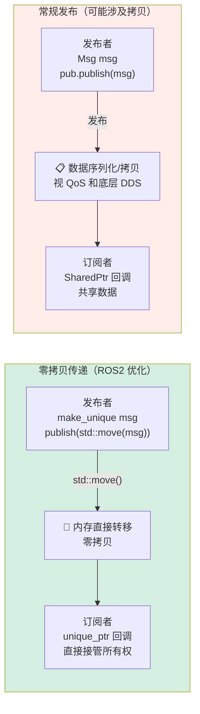

> **图注**：在机甲大师图像处理场景（1080p@120fps）中，零拷贝意义重大。使用 `std::move()` 发布 `unique_ptr` 消息，或使用 `cv_bridge::toCvShare`（而非 `toCvCopy`），可以显著降低内存带宽消耗和延迟。

**ROS1 消息传递（通常涉及拷贝）**

```cpp
// ROS1 发布消息通常需要拷贝
std_msgs::String msg;
msg.data = "Hello";

// 这里会发生拷贝
pub.publish(msg);

// 即使使用指针，也经常发生拷贝
std_msgs::StringPtr msg_ptr(new std_msgs::String);
msg_ptr->data = "Hello";
pub.publish(msg_ptr);  // 仍然可能发生拷贝
```

**ROS2 使用智能指针实现零拷贝**

```cpp
// 方式1：创建消息并发布（使用移动语义）
auto msg = std::make_unique<std_msgs::msg::String>();
msg->data = "Hello";
pub->publish(std::move(msg));  // 移动语义，避免拷贝

// 方式2：使用共享指针（推荐）
auto msg = std::make_shared<std_msgs::msg::String>();
msg->data = "Hello";
pub->publish(msg);  // 共享指针，不会拷贝数据

// 方式3：复用消息对象（最高效）
std_msgs::msg::String msg;
msg.data = "Hello";
pub->publish(msg);  // ROS2 会优化，尽可能避免拷贝
```

### 12.2 机甲大师图像处理完整示例

```cpp
class VisionNode : public rclcpp::Node {
public:
    VisionNode() : Node("vision_node") {
        // 使用共享指针回调，避免图像数据拷贝
        image_sub_ = this->create_subscription<sensor_msgs::msg::Image>(
            "camera/image", 
            rclcpp::SensorDataQoS(),
            std::bind(&VisionNode::imageCallback, this, std::placeholders::_1));
            
        // 使用 Lambda 表达式
        armor_sub_ = this->create_subscription<rm_msgs::msg::ArmorArray>(
            "armors",
            10,
            [this](const rm_msgs::msg::ArmorArray::SharedPtr msg) {
                this->armorCallback(msg);
            });
    }

private:
    void imageCallback(const sensor_msgs::msg::Image::SharedPtr msg) {
        // 性能监控
        auto start_time = std::chrono::steady_clock::now();
        
        // 使用 cv_bridge 转换图像
        cv_bridge::CvImagePtr cv_ptr;
        try {
            // toCvShare 共享数据（零拷贝）✅ 推荐
            cv_ptr = cv_bridge::toCvShare(msg, sensor_msgs::image_encodings::BGR8);
            
            // toCvCopy 会创建拷贝 ❌ 避免在高频回调中使用
            // cv_ptr = cv_bridge::toCvCopy(msg, sensor_msgs::image_encodings::BGR8);
        } catch (cv_bridge::Exception& e) {
            RCLCPP_ERROR(this->get_logger(), "cv_bridge exception: %s", e.what());
            return;
        }
        
        // 处理图像
        processImage(cv_ptr->image);
        
        // 性能统计
        auto end_time = std::chrono::steady_clock::now();
        auto duration = std::chrono::duration_cast<std::chrono::microseconds>(
            end_time - start_time);
        RCLCPP_DEBUG(this->get_logger(), 
                    "图像处理耗时: %ld μs", 
                    duration.count());
    }
    
    void armorCallback(const rm_msgs::msg::ArmorArray::SharedPtr msg) {
        if (msg->armors.empty()) return;
        
        for (const auto& armor : msg->armors) {
            RCLCPP_DEBUG(this->get_logger(), 
                        "发现装甲板: ID=%d, 置信度=%.2f", 
                        armor.id, armor.confidence);
        }
    }
    
    void processImage(const cv::Mat& image) {
        // 图像处理逻辑
    }
    
    rclcpp::Subscription<sensor_msgs::msg::Image>::SharedPtr image_sub_;
    rclcpp::Subscription<rm_msgs::msg::ArmorArray>::SharedPtr armor_sub_;
};
```

---

## 13. 组件化与生命周期管理

### 13.1 组件化节点设计对比

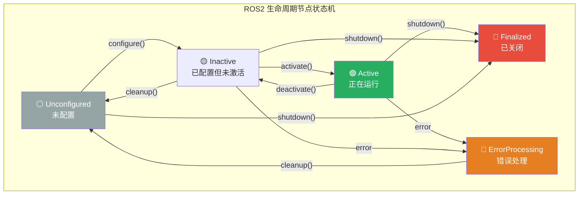

> **图注**：ROS2 生命周期节点（`LifecycleNode`）相比普通节点提供了精确的状态管理。在机甲大师场景中，这意味着可以在不重启节点的情况下动态重配置跟踪参数（如从标准模式切换到前哨模式）。

**ROS1 非组件化节点**

```cpp
// ROS1 传统节点（难以复用）
#include <ros/ros.h>

class TrackerNode {
public:
    TrackerNode() {
        nh_ = ros::NodeHandle();
        private_nh_ = ros::NodeHandle("~");
        
        // 初始化
        init();
    }
    
    void init() {
        pub_ = nh_.advertise<geometry_msgs::Twist>("cmd_vel", 10);
        sub_ = nh_.subscribe("armors", 10, &TrackerNode::callback, this);
    }
    
private:
    ros::NodeHandle nh_;
    ros::NodeHandle private_nh_;
    ros::Publisher pub_;
    ros::Subscriber sub_;
};
```

**ROS2 组件化节点**

```cpp
#include <rclcpp/rclcpp.hpp>
#include <rclcpp_components/register_node_macro.hpp>

namespace rm_tracker {

class TrackerComponent : public rclcpp::Node {
public:
    // ROS2 组件化构造函数（必须接受 NodeOptions）
    explicit TrackerComponent(const rclcpp::NodeOptions & options) 
        : Node("tracker_component", options) {
        
        // 从选项获取参数
        std::string config_path = this->declare_parameter("config_path", "");
        double update_rate = this->declare_parameter("update_rate", 50.0);
        
        RCLCPP_INFO(this->get_logger(), 
                   "组件初始化 - 配置路径: %s, 更新频率: %.1f Hz", 
                   config_path.c_str(), update_rate);
        
        initialize(config_path, update_rate);
    }

private:
    void initialize(const std::string &config_path, double update_rate) {
        angle_pub_ = this->create_publisher<geometry_msgs::msg::Vector3>("auto_angle", 10);
        debug_pub_ = this->create_publisher<std_msgs::msg::Float64>("/debugpub", 10);
        
        armors_sub_ = this->create_subscription<rm_msgs::msg::ArmorArray>(
            "/armor_array", 10,
            std::bind(&TrackerComponent::armorCallback, this, std::placeholders::_1)
        );
        
        timer_ = this->create_wall_timer(
            std::chrono::milliseconds(static_cast<int>(1000.0 / update_rate)),
            std::bind(&TrackerComponent::timerCallback, this)
        );
        
        RCLCPP_INFO(this->get_logger(), "跟踪器组件初始化完成");
    }
    
    void armorCallback(const rm_msgs::msg::ArmorArray::SharedPtr msg) {
        latest_armors_ = msg;
    }
    
    void timerCallback() {
        if (latest_armors_) {
            processTracking();
        }
    }
    
    void processTracking() {
        auto angle_msg = geometry_msgs::msg::Vector3();
        angle_msg.x = 0.1;  // pitch
        angle_msg.y = 0.2;  // yaw
        angle_msg.z = 1;    // 控制标志
        
        angle_pub_->publish(angle_msg);
    }
    
    rclcpp::Publisher<geometry_msgs::msg::Vector3>::SharedPtr angle_pub_;
    rclcpp::Publisher<std_msgs::msg::Float64>::SharedPtr debug_pub_;
    rclcpp::Subscription<rm_msgs::msg::ArmorArray>::SharedPtr armors_sub_;
    rclcpp::TimerBase::SharedPtr timer_;
    rm_msgs::msg::ArmorArray::SharedPtr latest_armors_;
};

}  // namespace rm_tracker

// 注册组件（重要！必须添加此宏）
RCLCPP_COMPONENTS_REGISTER_NODE(rm_tracker::TrackerComponent)
```

### 13.2 生命周期节点实现

> 详细的生命周期节点实现（`on_configure`、`on_activate`、`on_deactivate`、`on_cleanup`、`on_shutdown` 五个回调）可参考第 [13.1](#131-组件化节点设计对比) 节的状态机图，按照各状态职责分别实现对应的回调函数。

---

## 14. 执行器与多线程处理

### 14.1 执行器架构对比

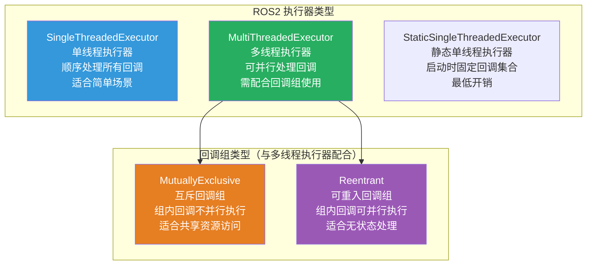

> **图注**：机甲大师自瞄系统中，推荐将图像处理回调（耗时、有共享状态）放入 `MutuallyExclusive` 组，将状态查询回调（短时、无状态）放入 `Reentrant` 组，并使用 `MultiThreadedExecutor(4)` 运行，充分利用多核性能。

**ROS1 执行器（单线程）**

```cpp
// ROS1 默认单线程
ros::spin();

// ROS1 多线程（有限支持）
ros::MultiThreadedSpinner spinner(4);  // 4 个线程
spinner.spin();

// ROS1 异步 spinner
ros::AsyncSpinner spinner(4);
spinner.start();
ros::waitForShutdown();
```

**ROS2 执行器（更灵活）**

```cpp
#include "rclcpp/rclcpp.hpp"
#include "rclcpp/executors.hpp"

// 方式1：单线程执行器（默认）
rclcpp::spin(std::make_shared<MyNode>());

// 方式2：多线程执行器（推荐用于机甲大师）
auto executor = std::make_shared<rclcpp::executors::MultiThreadedExecutor>(
    rclcpp::executors::MultiThreadedExecutor::Options().number_of_threads(4)
);
auto node = std::make_shared<MyNode>();
executor->add_node(node);
executor->spin();
```

---

## 15. 参数动态重配置

### 15.1 参数动态重配置对比

**ROS1 动态参数（需要 `dynamic_reconfigure`）**

```cpp
// ROS1 需要单独的 dynamic_reconfigure 包
#include <dynamic_reconfigure/server.h>
#include <my_tracker/TrackerConfig.h>

class TrackerNode {
public:
    TrackerNode() {
        dyn_rec_server_.setCallback(
            boost::bind(&TrackerNode::dynamicReconfigureCallback, this, _1, _2));
    }
    
private:
    void dynamicReconfigureCallback(my_tracker::TrackerConfig &config, uint32_t level) {
        tracker_gain_ = config.tracker_gain;
        enable_debug_ = config.enable_debug;
        
        ROS_INFO("参数更新: gain=%.1f, debug=%s", 
                tracker_gain_, enable_debug_ ? "true" : "false");
    }
    
    dynamic_reconfigure::Server<my_tracker::TrackerConfig> dyn_rec_server_;
    double tracker_gain_;
    bool enable_debug_;
};
```

**ROS2 内置参数动态重配置**

```cpp
#include "rclcpp/rclcpp.hpp"
#include "rcl_interfaces/msg/parameter_descriptor.hpp"
#include "rcl_interfaces/msg/floating_point_range.hpp"

class ConfigurableNode : public rclcpp::Node {
public:
    ConfigurableNode() : Node("configurable_node") {
        // 声明参数并添加详细描述和范围约束
        this->declare_parameter<double>("tracker_gain", 15.0,
            rcl_interfaces::msg::ParameterDescriptor()
            .set__description("卡尔曼滤波器增益参数，影响跟踪响应速度")
            .set__floating_point_range({rcl_interfaces::msg::FloatingPointRange()
                .set__from_value(0.1)
                .set__to_value(100.0)
                .set__step(0.1)})
        );
        
        this->declare_parameter<bool>("enable_debug", false,
            rcl_interfaces::msg::ParameterDescriptor()
            .set__description("启用调试输出和可视化")
        );
        
        // 注册参数变更回调
        param_callback_handle_ = this->add_on_set_parameters_callback(
            std::bind(&ConfigurableNode::parametersCallback, this, std::placeholders::_1)
        );
    }

private:
    rcl_interfaces::msg::SetParametersResult parametersCallback(
        const std::vector<rclcpp::Parameter> &parameters) {
        
        rcl_interfaces::msg::SetParametersResult result;
        result.successful = true;
        
        for (const auto &param : parameters) {
            if (param.get_name() == "tracker_gain") {
                double new_gain = param.as_double();
                tracker_gain_ = new_gain;
                RCLCPP_INFO(this->get_logger(), "更新增益: %.1f", new_gain);
                
                // 应用新参数到算法
                if (tracker_) tracker_->setGain(new_gain);
            }
            else if (param.get_name() == "enable_debug") {
                enable_debug_ = param.as_bool();
                RCLCPP_INFO(this->get_logger(), "调试模式: %s", 
                           enable_debug_ ? "启用" : "禁用");
            }
        }
        
        return result;
    }
    
    rclcpp::node_interfaces::OnSetParametersCallbackHandle::SharedPtr param_callback_handle_;
    double tracker_gain_ = 15.0;
    bool enable_debug_ = false;
    std::unique_ptr<Tracker> tracker_;
};
```

> **💡 运行时动态修改参数命令**：
> ```bash
> # ROS2 通过命令行修改运行中节点的参数
> ros2 param set /configurable_node tracker_gain 20.0
> ros2 param set /configurable_node enable_debug true
> 
> # 查看参数
> ros2 param get /configurable_node tracker_gain
> ros2 param dump /configurable_node
> ```

---

## 16. 动作服务器与客户端

### 16.1 动作框架对比

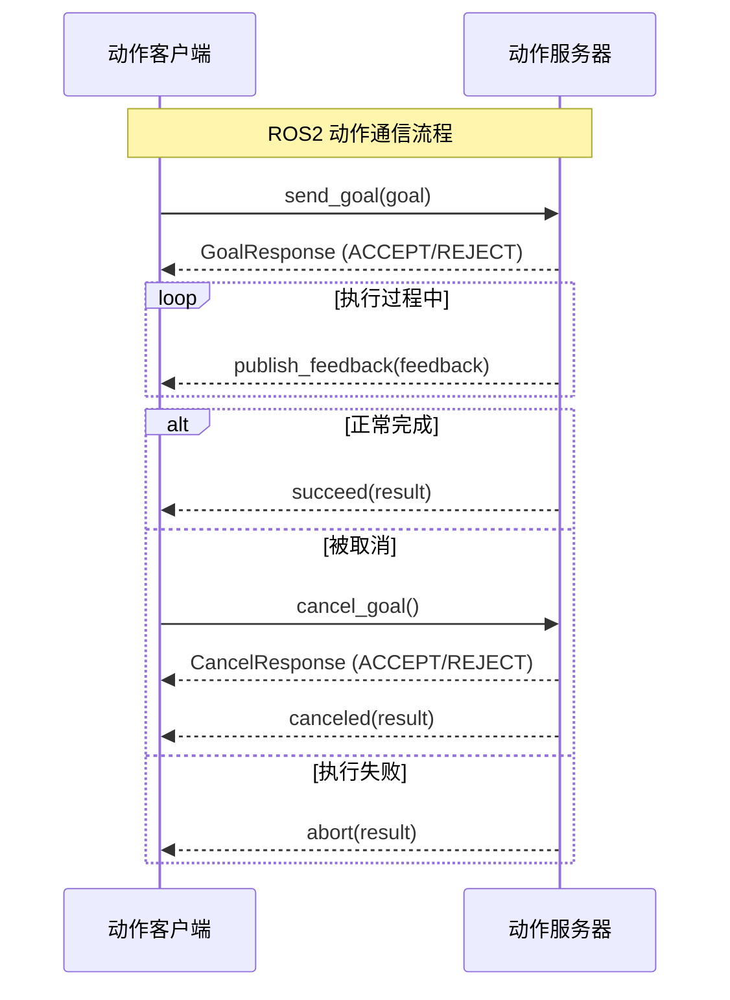

> **图注**：动作（Action）适合需要反馈进度的长时任务，如"跟踪目标直到命中"。ROS2 动作相比 ROS1 的 `actionlib` 更加类型安全，且原生支持取消操作和目标抢占。

**ROS1 动作服务器（actionlib）**

```cpp
// ROS1 使用 actionlib
#include <actionlib/server/simple_action_server.h>
#include <my_package/TrackTargetAction.h>

class ROS1TrackerActionServer {
public:
    ROS1TrackerActionServer(ros::NodeHandle& nh) 
        : server_(nh, "track_target", 
                 boost::bind(&ROS1TrackerActionServer::execute, this, _1), false) {
        server_.start();
    }
    
private:
    void execute(const my_package::TrackTargetGoalConstPtr& goal) {
        my_package::TrackTargetFeedback feedback;
        my_package::TrackTargetResult result;
        
        for (int i = 1; i <= 10; ++i) {
            if (server_.isPreemptRequested()) {
                server_.setPreempted();
                return;
            }
            
            feedback.progress = i * 10;
            server_.publishFeedback(feedback);
            
            ros::Duration(1.0).sleep();
        }
        
        result.success = true;
        server_.setSucceeded(result);
    }
    
    actionlib::SimpleActionServer<my_package::TrackTargetAction> server_;
};
```

**ROS2 动作服务器**

```cpp
#include "rclcpp/rclcpp.hpp"
#include "rclcpp_action/rclcpp_action.hpp"
#include "my_interface/action/track_target.hpp"

class TrackerActionServer : public rclcpp::Node {
public:
    using TrackTarget = my_interface::action::TrackTarget;
    using GoalHandleTrackTarget = rclcpp_action::ServerGoalHandle<TrackTarget>;

    TrackerActionServer() : Node("tracker_action_server") {
        action_server_ = rclcpp_action::create_server<TrackTarget>(
            this,
            "track_target",
            std::bind(&TrackerActionServer::handleGoal, this, 
                     std::placeholders::_1, std::placeholders::_2),
            std::bind(&TrackerActionServer::handleCancel, this, 
                     std::placeholders::_1),
            std::bind(&TrackerActionServer::handleAccepted, this, 
                     std::placeholders::_1)
        );
    }

private:
    rclcpp_action::Server<TrackTarget>::SharedPtr action_server_;
    
    rclcpp_action::GoalResponse handleGoal(
        const rclcpp_action::GoalUUID &uuid,
        std::shared_ptr<const TrackTarget::Goal> goal) {
        
        (void)uuid;
        if (goal->target_id < 1 || goal->target_id > 8) {
            return rclcpp_action::GoalResponse::REJECT;
        }
        return rclcpp_action::GoalResponse::ACCEPT_AND_EXECUTE;
    }
    
    rclcpp_action::CancelResponse handleCancel(
        const std::shared_ptr<GoalHandleTrackTarget> goal_handle) {
        (void)goal_handle;
        return rclcpp_action::CancelResponse::ACCEPT;
    }
    
    void handleAccepted(const std::shared_ptr<GoalHandleTrackTarget> goal_handle) {
        // 在新线程中执行，避免阻塞其他回调
        std::thread{std::bind(&TrackerActionServer::execute, this, 
                             std::placeholders::_1), goal_handle}.detach();
    }
    
    void execute(const std::shared_ptr<GoalHandleTrackTarget> goal_handle) {
        auto result = std::make_shared<TrackTarget::Result>();
        auto feedback = std::make_shared<TrackTarget::Feedback>();
        
        for (int i = 1; i <= 10 && rclcpp::ok(); ++i) {
            if (goal_handle->is_canceling()) {
                result->success = false;
                result->message = "跟踪被用户取消";
                goal_handle->canceled(result);
                return;
            }
            
            feedback->progress = i * 10;
            feedback->current_distance = 10.0 - i * 0.5;
            feedback->tracking_confidence = 0.5 + i * 0.05;
            
            goal_handle->publish_feedback(feedback);
            std::this_thread::sleep_for(std::chrono::milliseconds(500));
        }
        
        result->success = true;
        result->message = "目标跟踪完成";
        goal_handle->succeed(result);
    }
};
```

---

## 17. 服务服务器与客户端

### 17.1 服务完整对比

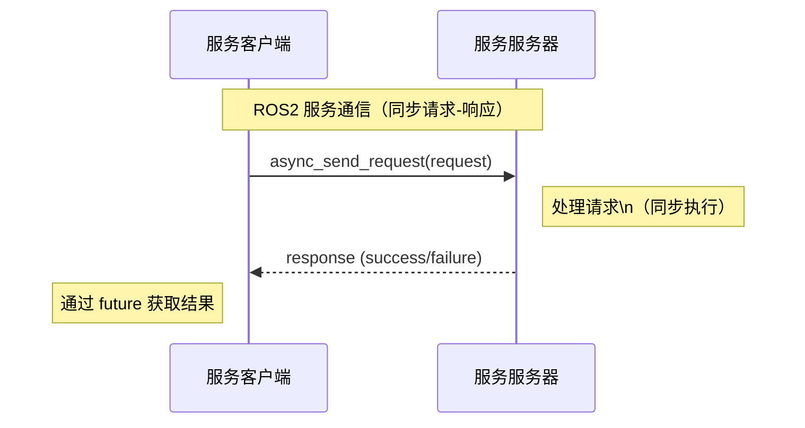

> **图注**：服务（Service）适合需要立即返回结果的短时请求，如"切换跟踪模式"。与动作不同，服务是同步的，调用方会等待服务端处理完毕才继续执行。

**ROS1 服务服务器**

```cpp
#include <ros/ros.h>
#include <my_package/SetTrackerMode.h>

class ROS1TrackerServiceServer {
public:
    ROS1TrackerServiceServer(ros::NodeHandle& nh) {
        service_ = nh.advertiseService(
            "set_tracker_mode",
            &ROS1TrackerServiceServer::handleService,
            this
        );
    }
    
private:
    bool handleService(my_package::SetTrackerMode::Request& req,
                      my_package::SetTrackerMode::Response& res) {
        if (req.mode == "standard" || req.mode == "balance" || req.mode == "outpost") {
            current_mode_ = req.mode;
            res.success = true;
            res.message = "模式切换成功: " + req.mode;
        } else {
            res.success = false;
            res.message = "无效的模式: " + req.mode;
        }
        
        return true;
    }
    
    ros::ServiceServer service_;
    std::string current_mode_;
};
```

**ROS2 服务服务器**

```cpp
#include "rclcpp/rclcpp.hpp"
#include "my_interface/srv/set_tracker_mode.hpp"

class TrackerServiceServer : public rclcpp::Node {
public:
    using SetTrackerMode = my_interface::srv::SetTrackerMode;

    TrackerServiceServer() : Node("tracker_service_server") {
        service_ = this->create_service<SetTrackerMode>(
            "set_tracker_mode",
            std::bind(&TrackerServiceServer::handleService, this,
                     std::placeholders::_1, std::placeholders::_2, std::placeholders::_3)
        );
        
        current_mode_ = "standard";
        RCLCPP_INFO(this->get_logger(), "服务服务器已启动");
    }

private:
    void handleService(
        const std::shared_ptr<rmw_request_id_t> request_header,
        const std::shared_ptr<SetTrackerMode::Request> request,
        const std::shared_ptr<SetTrackerMode::Response> response) {
        
        (void)request_header;
        
        std::string mode = request->mode;
        bool is_valid = (mode == "standard" || mode == "balance" || mode == "outpost");
        
        if (!is_valid) {
            response->success = false;
            response->message = "无效的模式: " + mode + 
                              " (有效模式: standard, balance, outpost)";
            RCLCPP_ERROR(this->get_logger(), "无效的跟踪模式: %s", mode.c_str());
            return;
        }
        
        std::string old_mode = current_mode_;
        current_mode_ = mode;
        
        response->success = true;
        response->message = "模式切换成功: " + old_mode + " -> " + mode;
        
        RCLCPP_INFO(this->get_logger(), "跟踪模式已切换: %s -> %s", 
                   old_mode.c_str(), mode.c_str());
    }
    
    rclcpp::Service<SetTrackerMode>::SharedPtr service_;
    std::string current_mode_;
};
```

---

## 附录：快速迁移速查表

### API 对照速查

| 功能 | ROS1 | ROS2 |
|------|------|------|
| 初始化 | `ros::init(argc, argv, "name")` | `rclcpp::init(argc, argv)` |
| 节点句柄 | `ros::NodeHandle nh` | `this->` (节点类成员) |
| 创建发布者 | `nh.advertise<T>("topic", 10)` | `this->create_publisher<T>("topic", 10)` |
| 创建订阅者 | `nh.subscribe("topic", 10, cb)` | `this->create_subscription<T>("topic", 10, cb)` |
| 获取时间 | `ros::Time::now()` | `this->now()` |
| 日志 INFO | `ROS_INFO("msg")` | `RCLCPP_INFO(this->get_logger(), "msg")` |
| 日志 WARN | `ROS_WARN("msg")` | `RCLCPP_WARN(this->get_logger(), "msg")` |
| 参数获取 | `nh.param<T>("key", var, default)` | `this->declare_parameter<T>("key", default)` + `this->get_parameter("key", var)` |
| 主循环 | `ros::spin()` | `rclcpp::spin(node)` |
| 关闭 | 自动 | `rclcpp::shutdown()` |
| 构建工具 | `catkin` | `ament_cmake` |
| 构建命令 | `catkin_make` | `colcon build` |
| 消息命名空间 | `pkg::Msg` | `pkg::msg::Msg` |
| 头文件扩展名 | `.h` | `.hpp` |
| TF 包 | `tf` | `tf2_ros` |
| 动作库 | `actionlib` | `rclcpp_action` |

### 常见迁移坑

> **⚠️ 注意以下常见错误：**
>
> 1. **忘记 `declare_parameter`**：ROS2 必须先声明参数才能获取，否则抛出异常。
> 2. **QoS 不匹配**：发布者和订阅者的 QoS 策略不兼容会导致无法通信（无错误提示！）。
> 3. **定时器回调签名变了**：ROS2 的定时器回调**无参数**，不像 ROS1 有 `TimerEvent`。
> 4. **消息命名空间**：`std_msgs::String` → `std_msgs::msg::String`，`ConstPtr` → `SharedPtr`。
> 5. **Launch 文件路径**：`$(find pkg)` → `$(find-pkg-share pkg)`（XML）或 `get_package_share_directory('pkg')`（Python）。
> 6. **`colcon build` 需要在工作空间根目录执行**，不是 `src/` 目录下。

---

*本文档基于 ROS2 Humble LTS 版本编写，适用于 ROS2 Humble / jazzy/ Rolling。*  
*如有问题或补充，欢迎在评论区交流。*